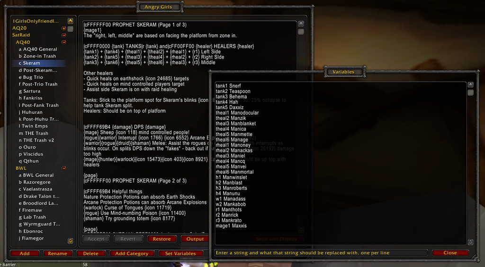

# Angry Girls

This is a fork of [Angry Assignments](https://www.curseforge.com/wow/addons/angry-assignments) with additions by &lt;girls only&gt; of Mankrik Horde. You can see the readme for Angry Assignments [here](ANGRYASSIGN_README.md).

## Additions from Angry Assignments

### `{page}` token

To accommodate  the girth of strategies required for AQ onwards, we have introduced a way to split an assignment up into multiple "pages" that can be paginated through on the client side. An example use of this would be to split an assignment up into a general strategy page, then individual pages for healers, tanks, and DPS. Simply add a `{page}` token where you would like the page break to occur.

To paginate through a page you left click on the assignment window. You can right click to go backwards. If there are pages to paginate through there will be a page counter (e.g. `(1/3)`) displayed on the top right of the window.

### Variable substitution

A new button, `Set Variables`, has been added to the editing window. This opens a text input box where you can define variable substitution. These are common tokens that you can add to an assignment that can be replaced by the text defined in the variables window.

For example, the line `offtanks Snerf and Hah` would replace all occurrences of `{offtanks}` in an assignment with the string `Snerf and Hah`.

### Bug fixes

Various bug fixes and inconsistencies for Classic have been fixed.
